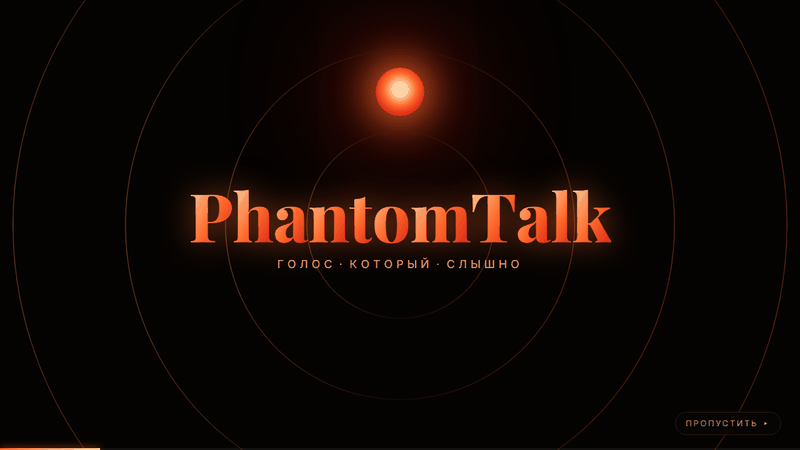
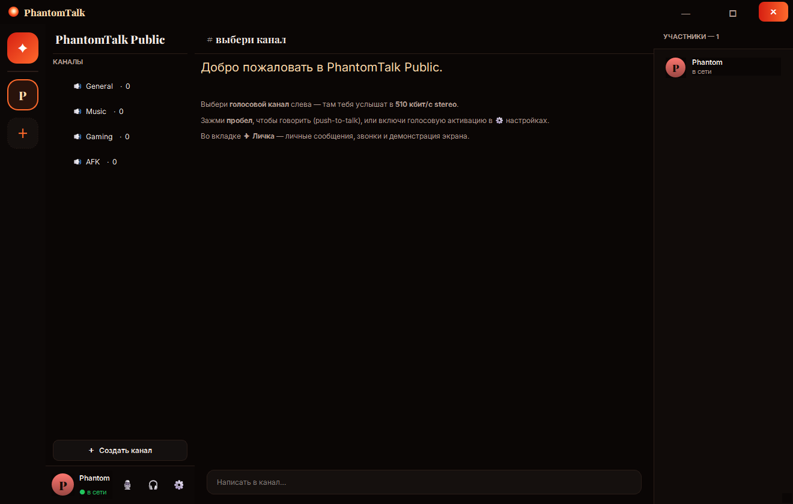
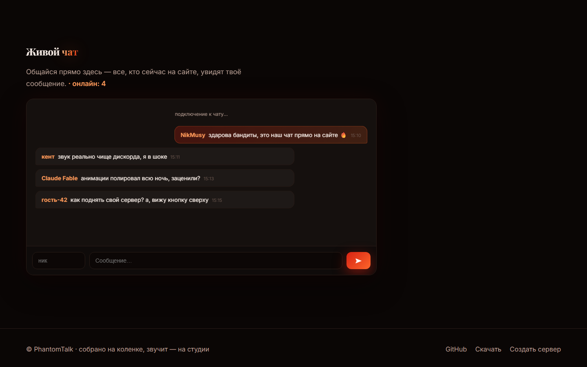
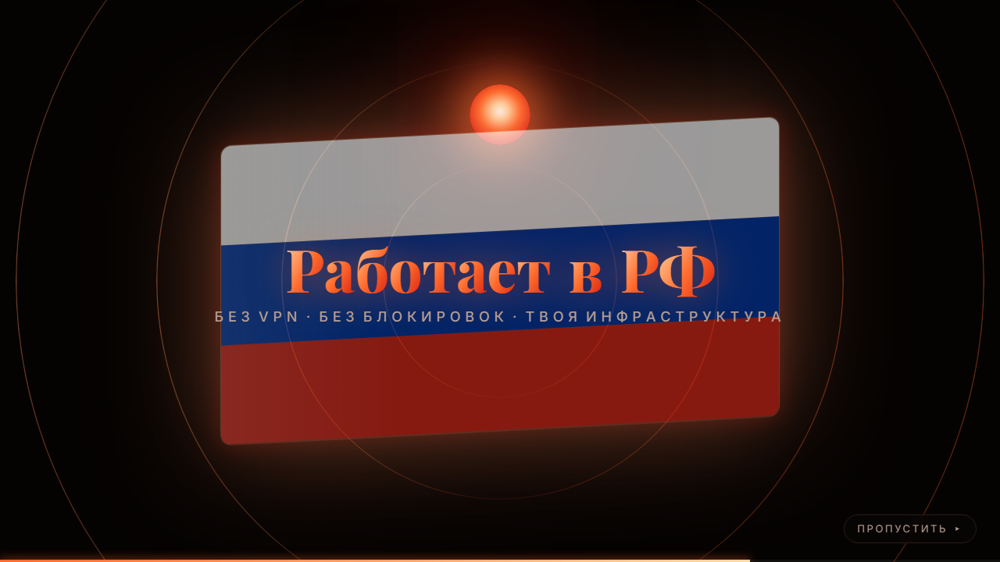
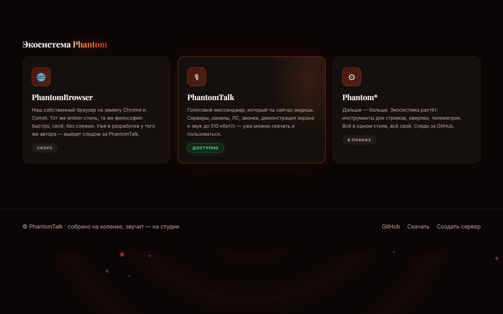

<p align="center">
  
</p>

<h1 align="center">PhantomTalk</h1>

<p align="center"><b>Голосовой мессенджер с собственными серверами. Качество звука выше Discord.</b></p>

<p align="center">
  <a href="#быстрый-старт">Быстрый старт</a> ·
  <a href="https://github.com/NikMusy/PhantomTalk/releases">Скачать .exe</a> ·
  <a href="#протокол">Протокол</a> ·
  <a href="#хостинг-через-cloudflare-tunnel">Cloudflare Tunnel</a>
</p>

<p align="center">
  
</p>

---

PhantomTalk — TeamSpeak-style голосовой чат с собственными серверами,
каналами, личными сообщениями, звонками 1-на-1 и демонстрацией экрана.
Использует Opus 48 kHz **stereo до 510 кбит/с** (стандартный голос
Discord — 64 кбит/с моно, Nitro — 384 кбит/с).

| Приложение (PyQt6, ember-тема) | Живой чат прямо на сайте |
|---|---|
|  |  |

| «Работает в РФ» — сцена интро | Экосистема Phantom |
|---|---|
|  |  |

- **Клиент:** одно красивое окно — кинематографичное приветствие, Discord-раскладка,
  ЛС + звонки + демонстрация экрана, шрифты Playfair Display / Inter
- **Сервер:** FastAPI + WebSocket + UDP voice relay + веб-чат, SQLite
- **Сайт:** анимированный лендинг (60-сек интро, искры, живой чат, server browser)
- **Установщик:** кинематографичный PhantomTalkSetup.exe с анимациями
- **EXE:** один файл ~55 MB через PyInstaller

## Быстрый старт

```powershell
git clone https://github.com/NikMusy/PhantomTalk
cd PhantomTalk
python -m pip install -r requirements.txt

# 1) Сервер (HTTP 9050, UDP 9051)
python server/server.py

# 2) Клиент
python client/main.py
```

Открой `http://127.0.0.1:9050` в браузере — там же создаются новые
голосовые серверы и видно онлайн.

## Скачать

- **Windows .exe** — [Releases](https://github.com/NikMusy/PhantomTalk/releases)
  или сборка локально: `python build_exe.py`
- Все зависимости в `requirements.txt`. Для libopus используется
  `libs/opus.dll` (BSD-3-Clause Xiph.Org).

## Архитектура

```
┌─────────────┐   HTTPS/REST   ┌─────────────┐
│  Browser    │ ─────────────▶ │             │
│  (landing)  │ ◀───────────── │             │
└─────────────┘                │             │
                               │  FastAPI    │
┌─────────────┐   WSS/JSON     │   server    │   SQLite
│  PyQt6      │ ──────────────▶│             │ ◀─── servers, channels
│  client A   │ ◀──── presence │             │
└─────┬───────┘                └─────┬───────┘
      │                              │
      │       UDP Opus packets       │  UDP relay
      └─────────────────────────────▶│  (no decoding,
                                     │   bit-perfect forward)
┌─────────────┐                      │
│  PyQt6      │ ◀────────────────────┘
│  client B   │      UDP Opus packets to same channel
└─────────────┘
```

Сервер **не декодирует** аудио — просто форвардит Opus-пакеты другим
участникам канала. Никакого пересжатия → качество прибывает к слушателю
ровно таким, каким его закодировал ваш микрофон.

## Протокол

UDP voice packet (client → server):

```
[VER:1=0x01][TOKEN:16][SERVER_ID:4 BE][CHANNEL_ID:4 BE][SEQ:4 BE][OPUS_PAYLOAD...]
```

Server → client:

```
[VER:1=0x01][SRC_TOKEN:16][SEQ:4 BE][OPUS_PAYLOAD...]
```

- TOKEN — выдаётся сервером в WebSocket-`welcome` после `hello`.
- Все мультибайтовые целые — Big Endian, без выравнивания.
- Opus payload — 20 мс кадр, 48 kHz stereo.

REST API: `GET /api/servers`, `POST /api/servers`, `GET /api/servers/{id}`,
`POST /api/servers/{id}/channels` (нужен `admin_token`).

WebSocket `/ws/{server_id}` — `hello → welcome → presence/chat/join_channel`.

## Хостинг через Cloudflare Tunnel

Cloudflare Tunnel не поддерживает UDP в бесплатном `cloudflared quick`,
поэтому HTTP (сайт + WebSocket signaling) пробрасываем через тоннель,
а UDP-порт `9051` открываем напрямую (port-forwarding на роутере).

```powershell
# Сайт + signaling — через cloudflared, получишь *.trycloudflare.com URL
cloudflared tunnel --url http://127.0.0.1:9050

# UDP-порт открой на роутере: 9051/udp → твой LAN-IP:9051
# Клиент к тебе подключается по тому же IP, который видит в адресе сервера.
```

Для постоянного домена — заведи Named Tunnel в Cloudflare Zero Trust,
для UDP — VPS со своим IP. Скрипт `scripts/cf-tunnel.ps1` помогает.

## Сборка .exe

```powershell
python build_exe.py
# результат: dist/PhantomTalk.exe + website/PhantomTalk.exe
```

## Лицензия

MIT. Opus codec — BSD-3-Clause (Xiph.Org).
